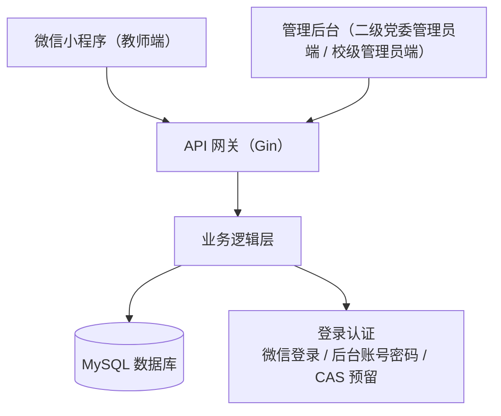
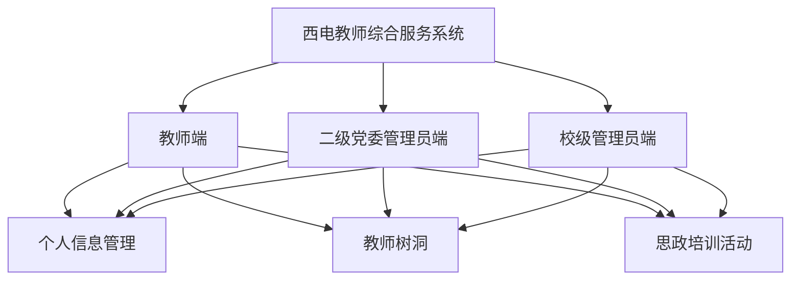

# 系统架构与功能结构

## 总体架构



## 功能结构



## API 路径

| 模块 | 路径 |
| --- | --- |
| 登录认证 | `/api/v1/auth` |
| 个人信息管理 | `/api/v1/profile` |
| 教师树洞 | `/api/v1/treeholes` |
| 思政培训 | `/api/v1/trainings` |

## 接口约定

```json
{
  "code": 0,
  "message": "ok",
  "data": {}
}
```

除登录接口外，请求需携带：

```text
Authorization: Bearer <token>
```

当前版本只保留三个端共用的个人信息管理、教师树洞、思政培训活动。其他业务模块暂不接入。
