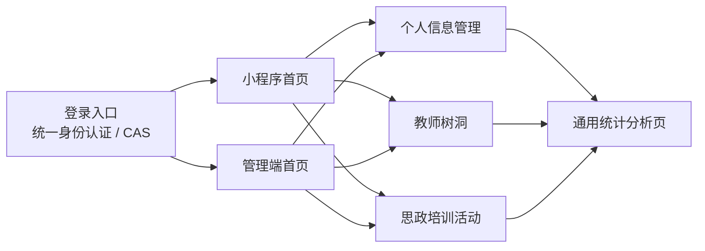
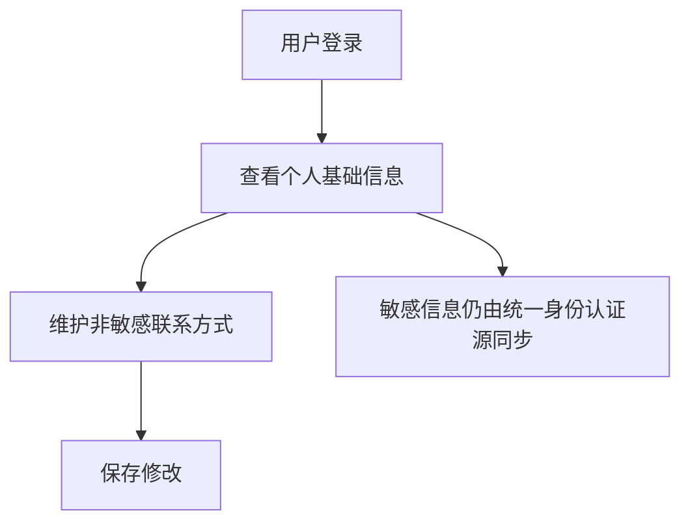
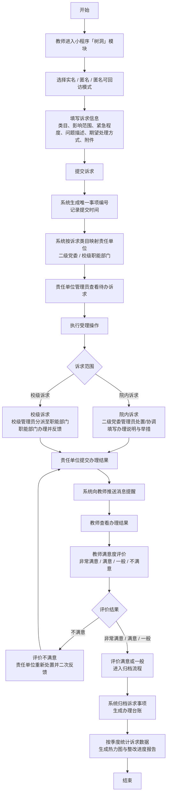
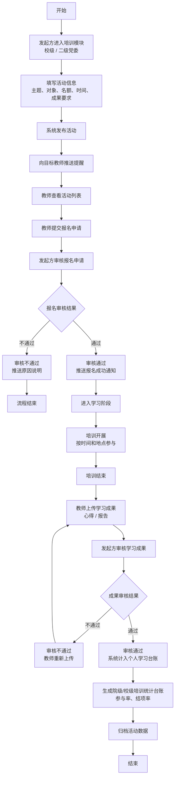
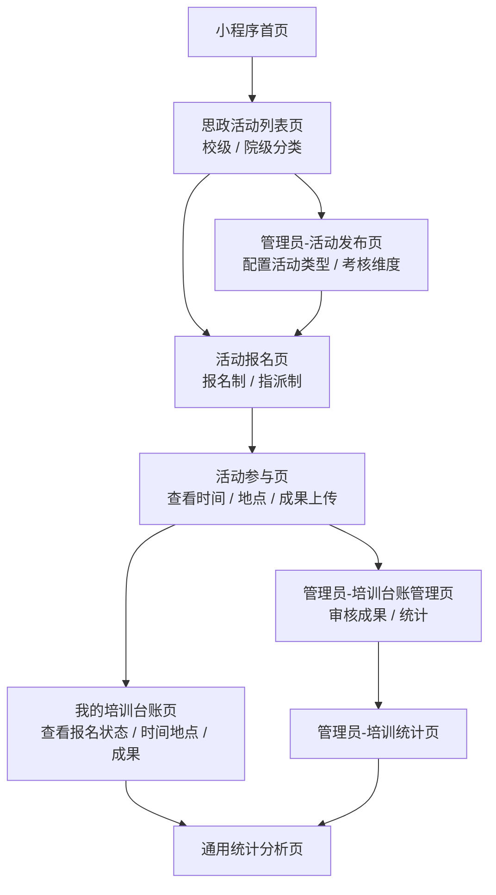
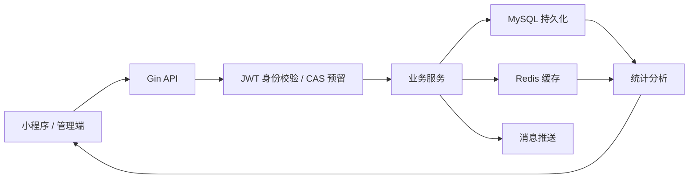

# 业务流程设计

## 1. 总体业务流程

当前系统围绕三个端和三个核心功能组织流程。三个端为教师端、二级党委管理员端、校级管理员端；三个核心功能为个人信息管理、教师树洞、思政培训活动。业务入口以统一身份认证登录为起点，教师端进入小程序首页，管理端进入 PC 管理后台，各端根据角色权限访问对应业务模块。

## 2. 个人信息管理流程

## 3. 教师树洞模块：诉求提交与办理流程

教师树洞模块围绕“提交 - 映射 - 受理 - 办理 - 反馈 - 评价 - 归档 - 统计”形成闭环。教师可选择实名、匿名、匿名可回访模式提交诉求；系统自动生成事项编号并根据类目映射责任单位；责任单位办理后推送结果，教师评价后归档。

### 3.1 树洞流程步骤

| 步骤 | 说明 |
| --- | --- |
| 进入模块 | 教师从小程序首页进入教师树洞模块。 |
| 选择提交模式 | 支持实名、匿名、匿名可回访三种模式。 |
| 填写诉求 | 选择诉求类目、影响范围、紧急程度，填写问题描述与期望处理方式，上传附件。 |
| 提交编号 | 系统生成唯一事项编号，记录提交人、提交时间和初始状态。 |
| 自动映射 | 根据诉求类目映射责任单位，区分二级党委与校级职能部门。 |
| 受理办理 | 管理员查看待办并受理，院内诉求由二级党委处置，校级诉求由校级管理员分派职能部门办理。 |
| 结果反馈 | 责任单位提交办理结果，系统向教师推送消息提醒。 |
| 满意度评价 | 教师评价办理结果；不满意则退回重新处置，满意或一般则归档。 |
| 归档统计 | 系统生成办理台账，并按季度生成诉求统计、热力图和整改进度报告。 |

## 4. 思政活动模块：培训活动报名与管理流程

思政活动模块围绕“活动发起 - 发布提醒 - 报名申请 - 报名审核 - 活动开展 - 成果上传 - 成果审核 - 台账统计 - 归档”形成闭环。发起方可以是校级管理员或二级党委管理员，教师端负责查看活动时间、地点、名额并报名、参与学习和上传成果，管理端负责报名审核、成果审核、统计台账与活动归档。

### 4.1 培训闭环步骤

| 步骤 | 说明 |
| --- | --- |
| 活动发起 | 发起方进入培训模块，填写主题、对象、名额、时间、成果要求等信息。 |
| 发布提醒 | 系统发布活动，并向目标教师推送活动提醒。 |
| 报名申请 | 教师查看活动列表，提交报名申请。 |
| 报名审核 | 发起方审核报名申请；不通过则推送原因并结束，通过则推送报名成功通知。 |
| 活动开展 | 培训开展后，教师按活动时间和地点参与。 |
| 成果上传 | 培训结束后，教师按要求上传心得、报告等学习成果。 |
| 成果审核 | 发起方审核学习成果；不通过则教师重新上传，通过则计入个人学习台账。 |
| 台账统计 | 系统生成院级或校级培训统计台账，统计参与率、结项率等指标。 |
| 活动归档 | 系统归档活动数据，流程结束。 |

### 4.2 思政培训页面流转

配图展示的是思政培训活动模块的页面流转。该流程以小程序首页为入口，教师进入培训活动列表页，管理员可发布活动并配置活动类型、时间、地点和名额，教师完成报名、参与和成果上传后进入个人培训台账；管理员侧可审核成果并查看统计，最终进入通用统计分析页。

### 4.3 页面流转步骤

| 步骤 | 说明 |
| --- | --- |
| 活动列表 | 教师从首页进入思政活动列表页，按校级、院级分类查看活动。 |
| 活动发布 | 管理员发布活动，配置活动类型、时间、地点、报名方式、名额、对象和成果要求。 |
| 活动报名 | 教师按报名制主动报名，或由管理员按指派制指派参与。 |
| 活动参与 | 教师按活动时间和地点参与，并可上传证书或成果材料。 |
| 个人台账 | 教师查看报名状态、活动时间地点、培训成果和审核结果。 |
| 管理台账 | 管理员审核报名与学习成果，统计参与率、结项率等指标。 |
| 统计分析 | 个人台账和管理员统计数据汇总至通用统计分析页。 |

## 5. 数据流转流程

## 6. 当前实现范围说明

当前项目优先围绕个人信息管理、教师树洞、思政培训活动三类核心业务搭建页面、接口和流程文档。树洞流程中的责任单位自动映射、二次反馈、季度热力图、整改进度报告，以及培训流程中的管理员发布、成果审核、统计分析属于完整业务流程设计内容，可按项目阶段逐步实现。
