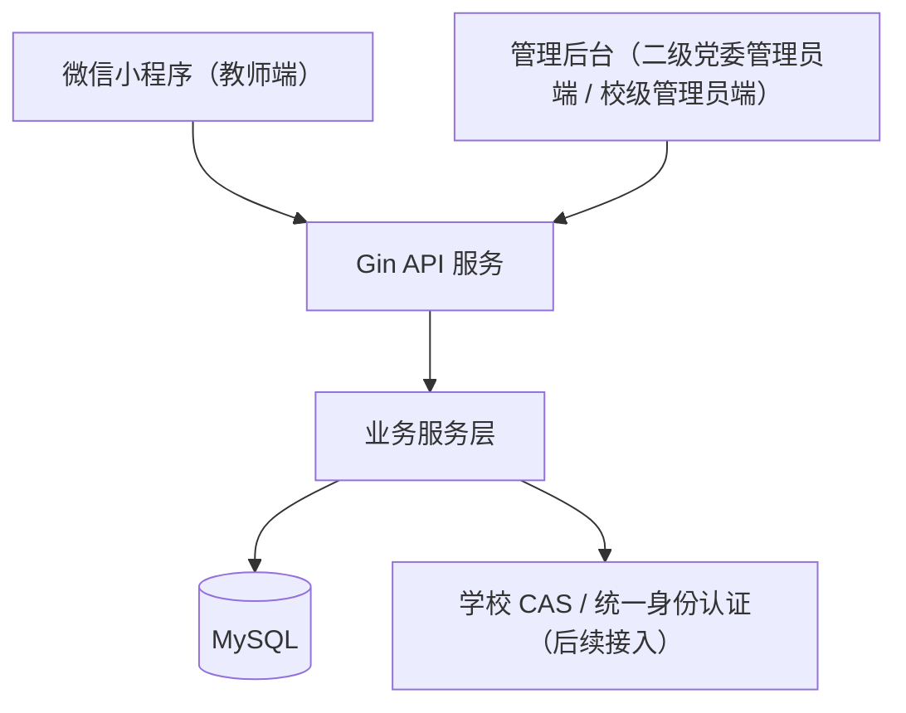

# 技术架构与部署设计

## 1. 架构模式

本项目采用前后端分离架构。前端包括微信小程序教师端和 Vue + Element Plus 管理后台，管理后台承载二级党委管理员端和校级管理员端当前骨架。后端采用 Gin API 服务，当前只保留个人信息管理、教师树洞、思政培训活动相关接口。

## 2. 技术选型

| 技术 | 用途 |
| --- | --- |
| Golang + Gin | 后端 API 服务 |
| 微信小程序 | 教师端移动入口 |
| Vue + Element Plus | 二级党委管理员端和校级管理员端后台页面 |
| MySQL | 用户、树洞、培训和培训记录数据存储 |

## 3. 接口边界

| 模块 | 当前接口范围 |
| --- | --- |
| 认证 | 微信登录占位、后台登录占位 |
| 个人信息管理 | 查看当前用户基础信息 |
| 教师树洞 | 诉求列表、诉求提交、满意度评价 |
| 思政培训活动 | 培训列表、培训报名、学习留痕、个人学习台账 |

## 4. 当前约束

- 三个端都只保留个人信息管理、教师树洞、思政培训活动。
- 不新增其他业务服务、菜单入口或数据表。
- 正式环境再接入统一身份认证、HTTPS 和真实数据库。
