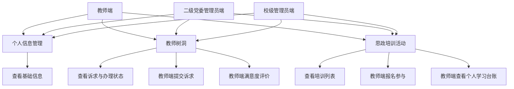

# 用例说明

## 当前开发范围

本项目当前只做三个端都能用的三个功能：个人信息管理、教师树洞、思政培训活动。三个端分别为教师端、二级党委管理员端、校级管理员端。其他功能暂不开发。

## 三端用例

## 页面和接口映射

| 功能 | 教师端页面 | 管理后台页面 | 后端模块 |
| --- | --- | --- | --- |
| 个人信息管理 | `miniprogram/pages/profile` | `admin/src/views/profile` | `profile` |
| 教师树洞 | `miniprogram/pages/treehole` | `admin/src/views/treehole` | `treehole` |
| 思政培训活动 | `miniprogram/pages/training` | `admin/src/views/training` | `training` |

## 暂不包含

思想状况调研、师德建设季报、学子说、数据统计与导出、系统运维、角色权限配置、通用支撑模块、管理员审批、管理员分派办理和报表生成功能。
